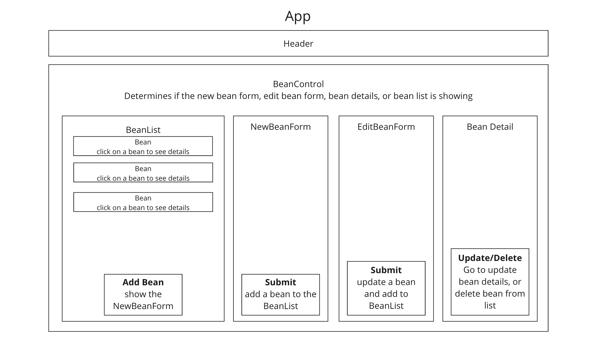

# _Coffee Shop Inventory_

#### By _**Seth Gonzales**_


## Technologies Used

- _JavaScript_
- _HTML_
- _CSS_
- _Bootstrap_
- _Node.js v18.17.1_
- _NPM v9.6.7_
- _React_
- _JSX_
- _PropTypes_

## Description

_In this [application](https://sethgonzales.github.io/coffee-shop/), users can utilize full CRUD functionality for any bags of coffee that are stored in the coffee shop's inventory. Additionally, the weight of each bag of coffee in the inventory is automatically updated with each bag sold. This application is build using React._

## Component Diagram



## Setup/Installation Requirements

* In terminal...
  * Clone the repository from GitHub using `$ git clone https://github.com/sethgonzales/coffee-shop.git` and navigate to the project's root directory.
  * Run `$ npm install` from the root directory to install all packages.
  * Build the project from the root directory using `$ npm run build`.
  * Run the project on a server in your browser using `$ npm run start`

## Known Bugs

- _Viewing not optimized for smaller screens._
- _If you find any additional bugs please report them to sethgonzales157@gmail.com_

## License

MIT License

```
Permission is hereby granted, free of charge, to any person obtaining a copy of this software and associated documentation files (the "Software"), to deal in the Software without restriction, including without limitation the rights to use, copy, modify, merge, publish, distribute, sublicense, and/or sell copies of the Software, and to permit persons to whom the Software is furnished to do so, subject to the following conditions:

The above copyright notice and this permission notice shall be included in all copies or substantial portions of the Software.

THE SOFTWARE IS PROVIDED "AS IS", WITHOUT WARRANTY OF ANY KIND, EXPRESS OR IMPLIED, INCLUDING BUT NOT LIMITED TO THE WARRANTIES OF MERCHANTABILITY, FITNESS FOR A PARTICULAR PURPOSE AND NONINFRINGEMENT. IN NO EVENT SHALL THE AUTHORS OR COPYRIGHT HOLDERS BE LIABLE FOR ANY CLAIM, DAMAGES OR OTHER LIABILITY, WHETHER IN AN ACTION OF CONTRACT, TORT OR OTHERWISE, ARISING FROM, OUT OF OR IN CONNECTION WITH THE SOFTWARE OR THE USE OR OTHER DEALINGS IN THE SOFTWARE.

Copyright © 2023
```

## Contact Information

If you encounter any additional bugs, please report them to sethgonzales157@gmail.com!

<p align="center"><a href="#">Return to Top</a></p>